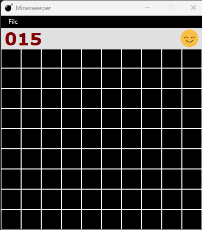
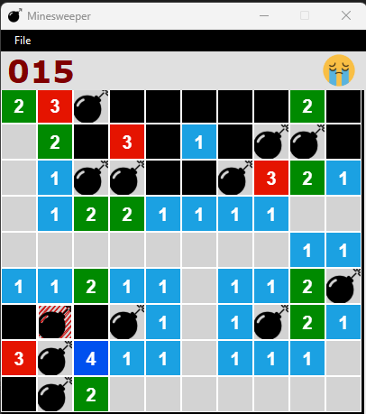

# Minesweeper Game

As a practice exercise, I built a Minesweeper game using Windows Form and implemented the Depth First Search algorithm to progressively reveal the adjacent tiles. The game features several customizable options, including the ability to create a custom-sized board with a variable number of mines.

In addition to the customizable options, the game also includes several interactive features. For example, the game displays a happy or sad emoji depending on whether or not the player clicks on a mine. This adds an element of fun to the game and provides instant feedback to the player.

If a player clicks on a mine and the sad emoji appears, they can reset the game panel by clicking on the emoji. This allows the player to start over and try again. This feature also helps to reduce player frustration and encourages them to keep playing and improving their skills.

Overall, the game provides a fun and engaging way to practice Depth First Search and improve problem-solving skills. It's a great way to pass the time while also challenging yourself and having fun.

 

